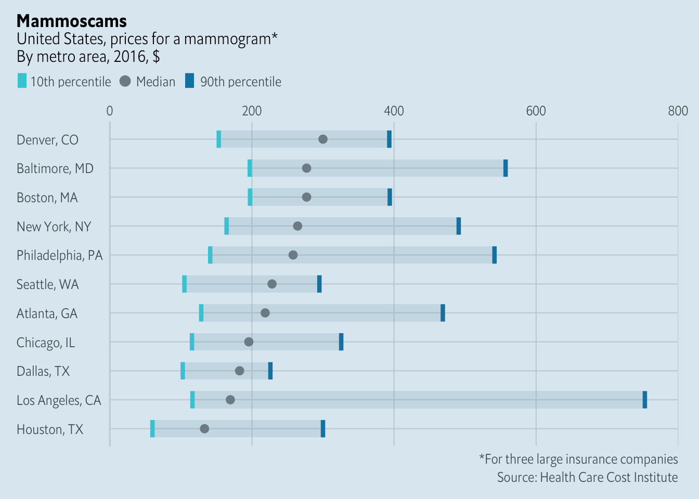
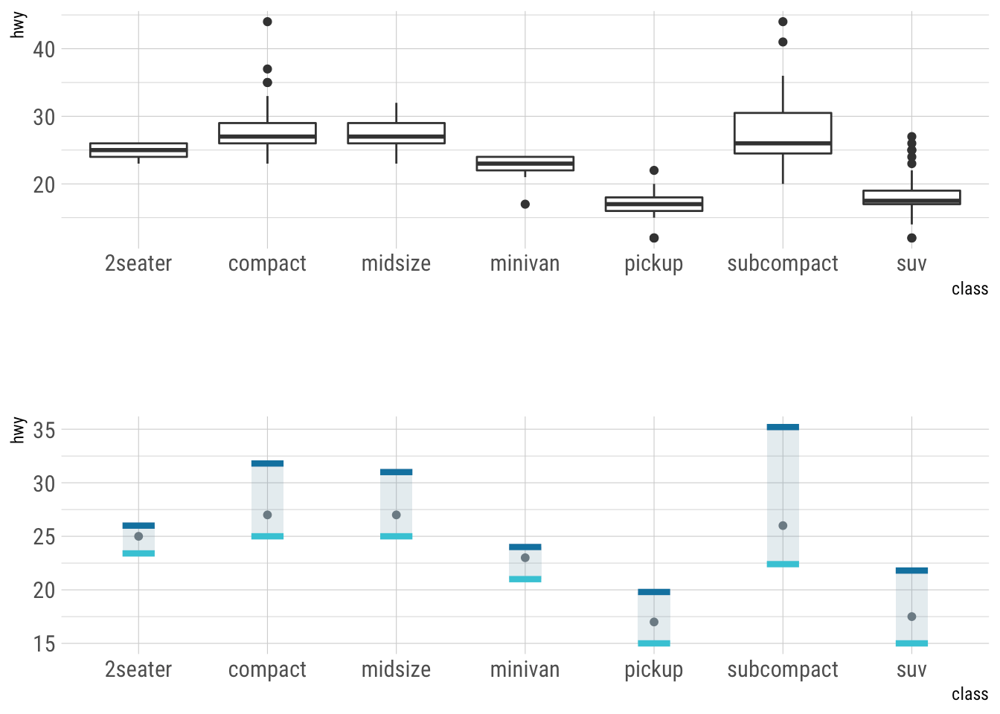
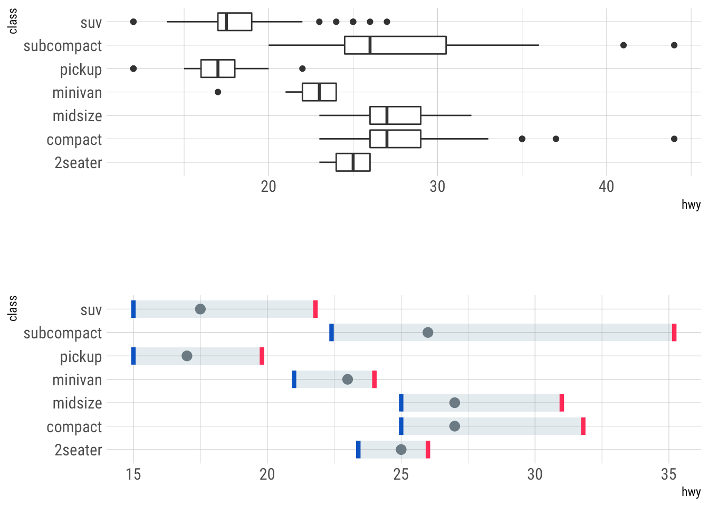
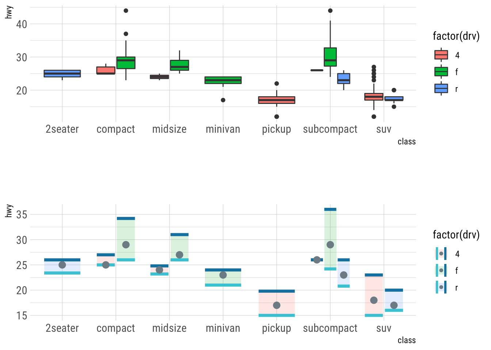
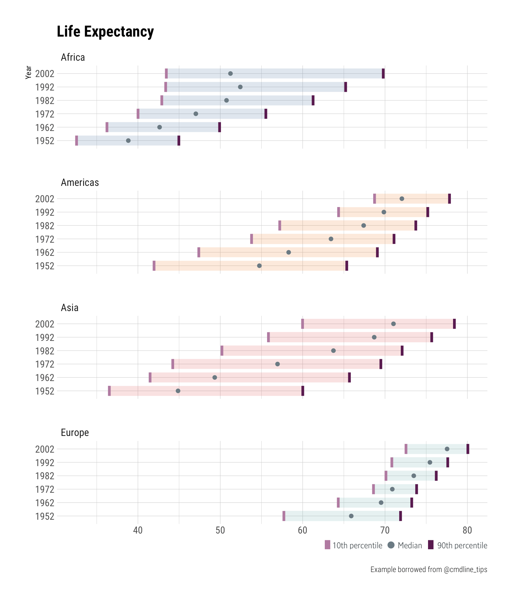

[](https://www.repostatus.org/#active)
[](https://keybase.io/hrbrmstr)

[](https://travis-ci.org/hrbrmstr/ggeconodist)
[](https://codecov.io/gh/hrbrmstr/ggeconodist)


# ggeconodist

Create Diminutive Distribution Charts

## Description

‘The Economist’ has a unique boxplot aesthetic for communicating
distribution characteristics. Tools are provided to create similar
charts in ‘ggplot2’.

Inspired by:
<https://www.economist.com/united-states/2019/06/29/will-transparent-pricing-make-americas-health-care-cheaper>

## What’s Inside The Tin

  - `add_econodist_legend`: Helper utility to get an econodist legend
    into a ggplot2 plot
  - `econodist_legend_grob`: Create a legend grob that can be used with
    econodist charts
  - `geom_econodist`: Econodist geom / stat
  - `left_align`: Helper to flush ggplot2 plot components to the left
  - `mammogram_costs`: Cost of a mammogram in various U.S. Cities
    (2016, USD)
  - `theme_econodist`: A more current Economist-style ggplot2 theme

The following functions are implemented:

## Installation

``` r
install.packages("ggeconodist", repos = "https://cinc.rud.is")
# or
remotes::install_git("https://git.rud.is/hrbrmstr/ggeconodist.git")
# or
remotes::install_git("https://git.sr.ht/~hrbrmstr/ggeconodist")
# or
remotes::install_gitlab("hrbrmstr/ggeconodist")
# or
remotes::install_bitbucket("hrbrmstr/ggeconodist")
# or
remotes::install_github("hrbrmstr/ggeconodist")
```

NOTE: To use the ‘remotes’ install options you will need to have the
[{remotes} package](https://github.com/r-lib/remotes) installed.

## Usage

``` r
library(ggeconodist)

# current version
packageVersion("ggeconodist")
## [1] '0.1.0'
```

### The whole shebang

**YOU WILL NEED** to install [these
fonts](https://github.com/economist-components/component-typography) to
use the built-in theme. More on how to do that at some point.

``` r
ggplot(mammogram_costs, aes(x = city)) +
  geom_econodist(
    aes(ymin = tenth, median = median, ymax = ninetieth),
    stat = "identity", show.legend = TRUE
  ) +
  scale_y_continuous(expand = c(0,0), position = "right", limits = range(0, 800)) +
  coord_flip() +
  labs(
    x = NULL, y = NULL,
    title = "Mammoscams",
    subtitle = "United States, prices for a mammogram*\nBy metro area, 2016, $",
    caption = "*For three large insurance companies\nSource: Health Care Cost Institute"
  ) +
  theme_econodist() -> gg

grid.newpage()
left_align(gg, c("subtitle", "title", "caption")) %>% 
  add_econodist_legend(econodist_legend_grob(), below = "subtitle") %>% 
  grid.draw()
```



``` r
library(dplyr)
library(patchwork)
library(hrbrthemes)
library(gapminder)

p <- ggplot(mpg, aes(class, hwy)) + theme_ipsum_rc()

(p + geom_boxplot()) +
(p + geom_econodist(width = 0.25)) +
  plot_layout(ncol = 1)
```



``` r

(p + geom_boxplot() + coord_flip()) +
(p + geom_econodist(tenth_col = ft_cols$blue, ninetieth_col = ft_cols$red) +
   coord_flip()) +
  plot_layout(ncol = 1)
```



``` r

(p + geom_boxplot(aes(fill = factor(drv)))) +
  (p + geom_econodist(aes(fill = factor(drv)))) +
  plot_layout(ncol = 1)
```



``` r
gapminder %>%
  filter(year %in% c(1952, 1962, 1972, 1982, 1992, 2002)) %>%
  filter(continent != "Oceania") %>%
  ggplot(aes(x = factor(year), y = lifeExp, fill = continent)) +
  geom_econodist(
    median_point_size = 1.2,
    tenth_col = "#b07aa1",
    ninetieth_col = "#591a4f",
    show.legend = FALSE
  ) +
  ggthemes::scale_fill_tableau(name = NULL) +
  coord_flip() +
  labs(
    x = "Year", title = "Life Expectancy", y = NULL,
    caption = "Example borrowed from @cmdline_tips"
  ) +
  facet_wrap(~continent, nrow = 4) +
  theme_ipsum_rc() -> gmgg

grid.newpage()
gmgg %>% 
  add_econodist_legend(
    econodist_legend_grob(
      tenth_col = "#b07aa1",
      ninetieth_col = "#591a4f",
    ), 
    below = "axis-b-1-4", 
    just = "right"
  ) %>% 
  grid.draw()
```



## ggeconodist Metrics

| Lang | \# Files |  (%) | LoC |  (%) | Blank lines |  (%) | \# Lines |  (%) |
| :--- | -------: | ---: | --: | ---: | ----------: | ---: | -------: | ---: |
| R    |       10 | 0.91 | 398 | 0.85 |          76 | 0.72 |      137 | 0.77 |
| Rmd  |        1 | 0.09 |  69 | 0.15 |          30 | 0.28 |       40 | 0.23 |

## Code of Conduct

Please note that this project is released with a Contributor Code of
Conduct. By participating in this project you agree to abide by its
terms.
